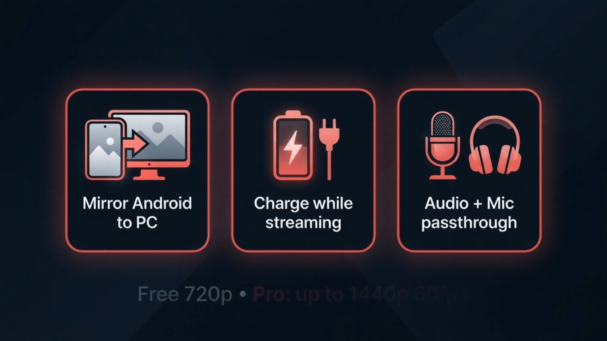
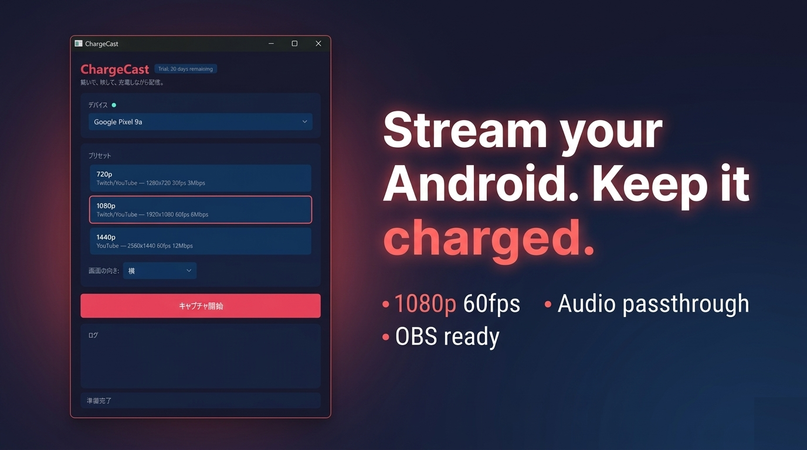
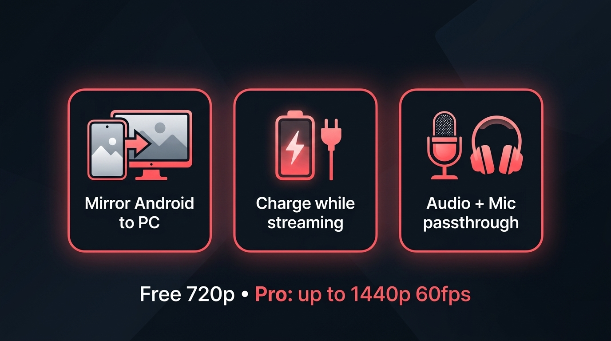
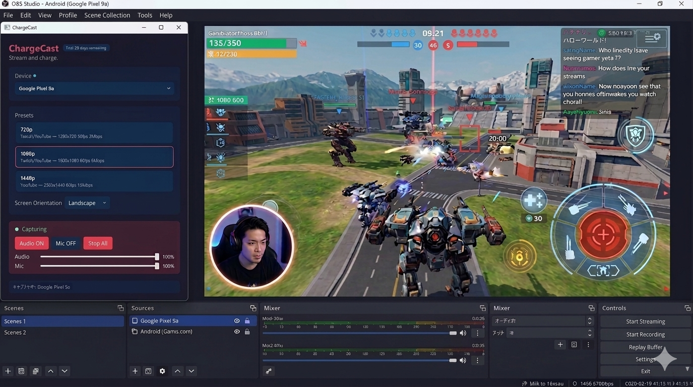

# ChargeCast ― USBでつなぐだけ、Android 配信がこんなに軽い

> **Plug in. Stream on. Stay charged.**
> USBケーブル1本で、Android の画面も音もマイクも、Windows にまるごと流し込む。

<video src="../assets/ChargeCast.mp4" controls poster="../assets/Thumbnail.png" style="max-width:100%">ブラウザが動画に対応していません</video>

[▶ Microsoft Store で入手する](https://apps.microsoft.com/detail/9N87X47V634V) ／ **7日間 無料トライアル**

---

## こんなことで詰まっていませんか

- Android ゲームを OBS で配信したい。でも **画面のキャプチャ・ゲーム音・自分のマイク** を全部きれいに混ぜるのが毎回大仕事
- Wi-Fi ミラーリングは **遅延** と **バッテリー** がつらい
- `scrcpy` を CLI で叩くのは慣れても **毎回ちょっと面倒**
- 配信中にスマホの電池が切れそうで **冷や汗**

ChargeCast は、この4つを **USB1本＋GUI** で丸ごと片付けるために作った Windows アプリです。

---

## 3分で配信できる ― Quick demo

> 「俺でも配信できそう」ってなる、一番短いルート。

### ① USB でつなぐ

Android の USB デバッグを ON にして、PC にケーブルで挿すだけ。
**ケーブルは充電ケーブルでOK**。そう、配信中ずっと充電されます。

### ② プリセットを選んで Start Capture

**720p / 1080p / 1440p / Custom** のボタンを選んでクリック1発。
scrcpy のウィンドウが立ち上がって、Android の画面がそのまま出てきます。OBS の Window Capture で掴むだけで、配信ソース完成。

### ③ 3つのスライダーでミックス

- **Device** … Android のゲーム音
- **Output** … PC側の BGM や Discord
- **Mic** … 自分の声

これを ChargeCast の画面だけで混ぜて、OBS 側には1ソース渡すだけ。**配信の音量バランスで喧嘩しない** ので、配信中にスライダーをいじる回数がぐっと減ります。

> ここまでで、だいたい **3分**。あとは OBS の「配信開始」を押すだけ。

---

## できること、ひと目で

| | |
|---|---|
| 📱 **Mirror Android to PC** | USB 経由で Android をそのまま Windows ウィンドウに |
| 🔋 **Charge while streaming** | 挿してるケーブルで常時給電。長時間配信でも熱と電池が怖くない |
| 🎙 **Audio + Mic passthrough** | デバイス音・PC音・マイクを **3チャンネル**で一括ミックス |
| 🎮 **配信プリセット内蔵** | 720p / 1080p / 1440p 60fps、Twitch・YouTube 向けに最適化済み |
| 🪟 **ウィンドウ位置を記憶** | 配信レイアウトを組み直さなくていい |
| 🌐 **22言語対応** | 日本語・英語・中国語・韓国語ほか |

---

## OBS に入れるとこうなる

ChargeCast のウィンドウを **OBS の Window Capture** に入れるだけ。Webカメラ・ゲーム画面・音声ソースが綺麗に1シーンに収まります。
配信している人の画面が普通に動いている、それがゴール。

---

## 価格

| プラン | 値段 | 内容 |
|---|---|---|
| **無料トライアル** | **7日間** | すべての機能を制限なしで試せる |
| **月額** | $4.99 / 月 | いつでも解約可 |
| **年額** | $49.99 / 年 | 月払いより **約2ヶ月ぶんお得** |

購入・解約はすべて Microsoft アカウント上で完結。ChargeCast 側でカード情報を預かりません。

[▶ 7日間トライアルをはじめる](https://apps.microsoft.com/detail/9N87X47V634V)

---

## こういう人に向いています

**ハマる人**
- OBS で Android ゲーム実況・アプリ紹介・チュートリアルを配信したい
- 有線の安定性がほしい
- 音周りをアプリ1つで終わらせたい
- 長時間配信でスマホの発熱と電池が不安

**向いていないかも**
- Mac / Linux で使いたい（Windows 専用です）
- 完全無料がいい（scrcpy を CLI で頑張る道があります）
- Wi-Fi ワイヤレスがいい（本アプリは USB 前提）

---

## よくある質問

**Q. root 化や特別な開発環境は必要？**
A. いりません。Android の「開発者オプション → USB デバッグ」を ON にするだけです。

**Q. ゲームの音と自分のマイクが同時に乗りますか？**
A. 乗ります。3 チャンネルミキサーで個別に音量調整できます。

**Q. 配信ソフトは何を使えばいい？**
A. OBS Studio を想定しています（Window Capture ソースで掴んでください）。XSplit など他のソフトでも同様の仕組みで動きます。

**Q. 画面が縦向きのゲームでも大丈夫？**
A. Orientation を Portrait / Landscape / Auto から選べます。配信レイアウトを崩さず固定できます。

**Q. ネットに勝手に繋ぎますか？**
A. キャプチャはすべてローカルの ADB 経由です。ChargeCast 自体は端末情報を外部へ送りません。

---

## 変更履歴

- **v1.6.1** — 安定化リリース
- **v1.6.0** — カスタムプリセットの仕上げ、scrcpy ウィンドウ管理の改善、Microsoft Store の7日間トライアルへ移行
- **v1.5.0** — Custom 解像度プリセット追加、ウィンドウ位置を記憶
- **v1.4.0** — Device Volume スライダーと 3 チャンネル・オーディオミキサーを実装
- **v1.3.x 以前** — 初期リリース、基本ミラーリングと音声転送

---

## OBS との連携について

ChargeCast は **単体で配信するアプリではありません**。
立ち位置としては「OBS にきれいに渡すための前段」です。

- ChargeCast のウィンドウを **OBS Studio の Window Capture** で掴むだけ
- 映像・音声・マイクはすでに ChargeCast 側でミックス済みなので、OBS 側のソースは最小限で済みます
- XSplit ／ Streamlabs ／ Discord の画面共有など、**Window Capture が使える環境なら同じ要領**で動きます

OBS のシーンを一度組んでしまえば、以降は「USB 挿して Start Capture を押す」だけ。配信開始までの手順が **ケーブル1本** に収束するのが、ChargeCast を使う一番の効用です。

---

## さあ、USB を挿して配信しよう

ケーブル1本で「配信部屋」が完成します。7日間無料で、全部ためせます。

[▶ Microsoft Store で ChargeCast を入手](https://apps.microsoft.com/detail/9N87X47V634V)

---

*ChargeCast は Microsoft Store から入手できる Windows アプリです。製品 ID: `sakura.dev.jp.ChargeCast` ／ 制作: sakura.dev.jp*
